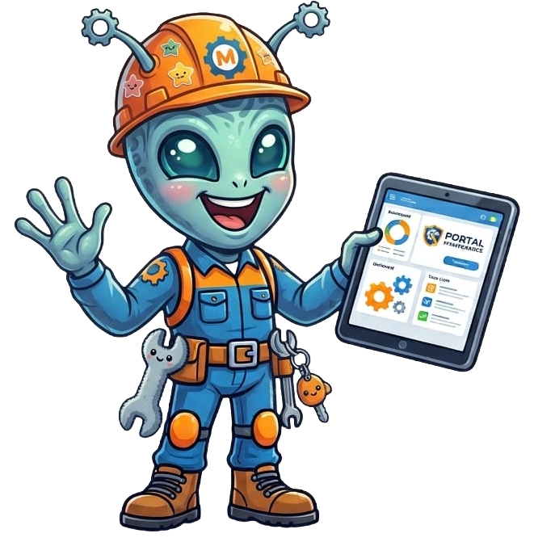
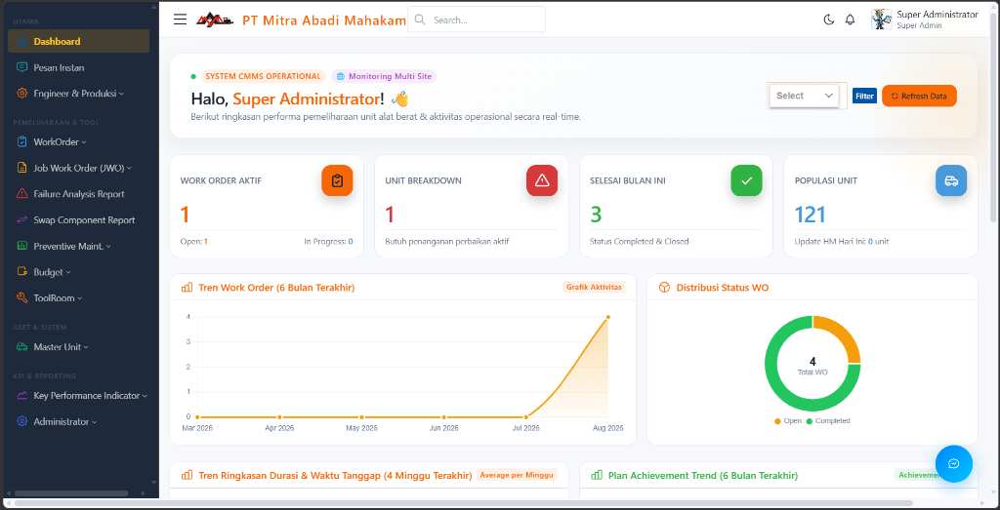
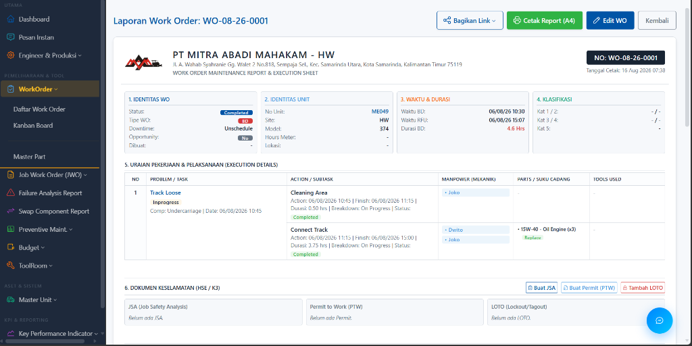

<div align="center">
  <br>
  <h1>CMMS AISFAR</h1>
  <p><b>Enterprise Computerized Maintenance Management System untuk Industri Pertambangan & Alat Berat</b></p>
  
  [](https://php.net/)
  [](https://laravel.com/)
  [](#)
</div>

<br>

## 📖 Tentang Aplikasi
**CMMS AISFAR** adalah Sistem Manajemen Pemeliharaan Aset dan Logistik Terpadu yang dirancang khusus untuk ekosistem industri pertambangan dan alat berat. Platform ini bertindak sebagai *Single Source of Truth* untuk mengelola seluruh siklus hidup armada tambang (Excavator, Dozer, Hauler, Grader, Support Unit) mulai dari pelaporan kerusakan (Pra-WO), eksekusi Work Order digital, manajemen perkakas (ToolRoom), perencanaan anggaran & penggantian komponen (PCR & PM), hingga analitik KPI keandalan unit.

Aplikasi ini mendigitalisasi operasional workshop menjadi **100% Paperless** didukung fitur *Digital Signature*, *Real-time Collaboration*, serta kontrol keamanan akses tingkat tinggi.

---

## ✨ Modul Utama (Ecosystem)

### 1. 🚜 Maintenance & Operasional (Lapangan)
- **Laporan Kerusakan (Pra-WO):** Pintu masuk pelaporan kerusakan unit dari lapangan untuk di-generate langsung menjadi Work Order.
- **Work Order Management:** Pencatatan breakdown, backlog, dan servis unit. Terintegrasi dengan pemotongan stok Part, dokumen HSE, timeline durasi mekanik, dan Approval Tanda Tangan Digital.
- **Kanban Board:** Visualisasi alur status pengerjaan unit (*Open, In Progress, Waiting Part, Completed*).
- **Hour Meter (HM):** Pencatatan dan import berkala jam kerja unit yang menjadi basis perhitungan otomatis jadwal PM dan estimasi PCR.
- **Job Work Order (JWO):** Pengelolaan pekerjaan fabrikasi dan servis yang dikerjakan oleh pihak ketiga (Vendor/Outsource).
- **Laporan Produksi Harian:** Pencatatan ritasi *Digger* dan *Hauler* per jam lengkap dengan jenis material tambang (Coal, OB, Top Soil) serta delay operasional.

### 2. 🔄 Planning & Reliability (Keandalan & Perencanaan)
- **Plan Component Replacement (PCR):** Modul estimasi dan jadwal penggantian komponen utama berdasarkan *Target Life (Hrs)*, *Current HM*, *Plan SMU*, dan *Daily Operating Hours*, lengkap dengan riwayat *Last Change Out* dan *Part Swapping*.
- **Preventive Maintenance (PM):** Template checklist servis berkala (PS1-PS4) terintegrasi jadwal otomatis berbasis Hour Meter (HM) dengan notifikasi *Due Date* dan *1-Click Auto-Generate WO*.
- **Plan Budget Bulanan (RAB):** Kontrol anggaran pemeliharaan (RAB vs Realisasi Biaya) per site dan per unit.
- **Failure Analysis Report (FAR):** Investigasi investigatif 4 pilar *Root Cause Analysis* (RCA) untuk kegagalan komponen mayor.
- **Swap Component Report:** Rekam jejak mutasi, kanibalisasi, dan perpindahan komponen antar-unit alat berat.

### 3. 🧰 ToolRoom & Workshop
- **Peminjaman Tool:** Sirkulasi check-in dan check-out perkakas kerja mekanik.
- **Approval Stok Tool:** Alur pengajuan dan persetujuan penambahan stok perkakas.
- **Berita Acara (B.A):** Laporan resmi kejadian kerusakan atau kehilangan alat kerja.
- **Stock Opname:** Audit fisik periodik dan penyesuaian inventaris perkakas.

### 4. 📈 KPI & Reporting
- **Report Breakdown & Downtime:** Analitik downtime unit, frekuensi kerusakan, serta klasifikasi breakdown.
- **KPI Master Data:** Kalkulasi metrik ketersediaan unit (*Physical Availability / PA*), MTTR (*Mean Time To Repair*), dan MTBF (*Mean Time Between Failures*) berstandar ISO 8601.

### 5. ⚙️ Master Data Terpusat
- **Master Unit (Asset):** Populasi alat berat, Model Unit, dan Tipe Unit.
- **Master Part & Komponen:** Katalog suku cadang terintegrasi multi-model unit (TomSelect) dan target jam operasional.
- **Master Vendor & Bengkel:** Database rekanan jasa servis dan fabrikasi luar.
- **Master Mekanik:** Data kepegawaian mekanik dengan pop-up riwayat lengkap kinerja & inventaris tool.
- **Master Tool & Kategori:** Database perkakas, spesifikasi, dan kuantitas stok.

### 6. 🔐 Administrator, Keamanan & Hak Akses
- **Manajemen User & Multi-Site:** Pengaturan pengguna berbasis lokasi tambang (Site).
- **Matriks Hak Akses (Categorized Permissions):** Manajemen perizinan Role dan User yang dikelompokkan secara rapi per kategori modul dengan tombol *quick-toggle* instan.
- **Approval Matrix & Digital Signatures:** Matriks persetujuan berjenjang untuk dokumen resmi.
- **Log Aktivitas & Backup DB:** Audit trail komprehensif seluruh transaksi dan fitur pencadangan database.
- **Pesan Instan (Live Chat):** Media koordinasi internal antar-pengguna secara *real-time*.

---

## 💻 Tech Stack & Arsitektur Enterprise

- **Backend:** Laravel 10 (PHP 8.1+)
- **Frontend / UI:** Blade Templating, Vanilla CSS/JS, Tabler UI Framework, TomSelect
- **Database:** MySQL / PostgreSQL
- **Security & Authorization:**
  - **Spatie Laravel-Permission:** Role-Based Access Control (RBAC) dengan granular permission per modul dan aksi.
  - **Hashids (Anti-IDOR):** Enkripsi parameter ID pada URL sensitif untuk perlindungan keamanan data.
  - **Spatie Activitylog:** Perekaman audit trail aktivitas pengguna secara otomatis.
- **Document Engine:** DomPDF untuk *export* laporan A4 ber-Kop Surat resmi.
- **Real-Time Engine:** Laravel WebSockets & Echo untuk fitur Live Chat dan Notifikasi.

---

## 🚀 Panduan Instalasi (Development)

### Persyaratan Sistem
- PHP >= 8.1
- Composer
- Node.js & NPM
- MySQL / MariaDB Server

### Langkah Instalasi

1. **Clone Repository**
   ```bash
   git clone https://github.com/plannermukti-ui/cmms-asifar.git
   cd cmms-asifar
   ```

2. **Install Dependensi PHP & Node.js**
   ```bash
   composer install
   npm install
   ```

3. **Konfigurasi Environment**
   Salin file `.env.example` menjadi `.env`:
   ```bash
   cp .env.example .env
   ```
   Atur konfigurasi database pada file `.env`:
   ```env
   DB_CONNECTION=mysql
   DB_HOST=127.0.0.1
   DB_PORT=3306
   DB_DATABASE=cmms_aisfar
   DB_USERNAME=root
   DB_PASSWORD=
   ```

4. **Generate Application Key & Migration**
   ```bash
   php artisan key:generate
   php artisan migrate --seed
   ```

5. **Jalankan Aplikasi**
   ```bash
   npm run dev
   # Buka terminal baru
   php artisan serve
   ```
   Aplikasi dapat diakses melalui `http://localhost:8000`.

---

## 👥 Struktur Peran (User Roles)

Sistem mendukung *Multi-Role* yang disesuaikan dengan struktur operasional tambang:
- **Super Administrator:** Akses penuh konfigurasi sistem, hak akses, master data, dan log audit.
- **Maintenance Superintendent / Planner:** Manajemen jadwal PM, evaluasi PCR, budget RAB, dan approval akhir.
- **Supervisor / Foreman:** Verifikasi Work Order, penugasan teknisi, dan review dokumen keselamatan kerja (HSE).
- **Mechanic:** Pengerjaan tugas Work Order, input jam kerja, dan peminjaman perkakas kerja.
- **Toolman / Warehouse:** Pengelolaan sirkulasi tool, permohonan stok, dan stock opname.
- **Engineer / Production:** Pemantauan data produksi armada tambang harian.

---

## 📸 Antarmuka Aplikasi (Screenshots)

### 1. Dashboard Eksekutif
Pusat kendali utama yang menyajikan metrik operasional *real-time*, tren status Work Order, unit breakdown, dan ketersediaan armada.


### 2. Plan Component Replacement (PCR)
Matriks estimasi waktu penggantian suku cadang utama berbasis target life, current HM, dan riwayat pergantian sebelumnya.

### 3. Detail & Laporan Work Order (Execution Sheet)
Halaman rincian eksekusi pemeliharaan lengkap dengan pembagian subtask, kebutuhan part, dan integrasi dokumen keselamatan K3 (JSA, PTW, LOTO).


### 4. Matriks Hak Akses Terkategori
Manajemen hak akses granular per kategori modul yang memudahkan administrator mengontrol perizinan pengguna secara presisi.

---

## 📚 Pusat Panduan (Guide)

Aplikasi dilengkapi modul Panduan Interaktif yang dapat diakses pada rute `/guide` lengkap dengan infografis, animasi modern, dan petunjuk penggunaan sistem.

---

<div align="center">
  <p>Dibuat dan dikembangkan untuk operasional <b>PT Mukti / CMMS AISFAR</b>.<br>Hak Cipta © 2026. Semua Hak Dilindungi.</p>
</div>
