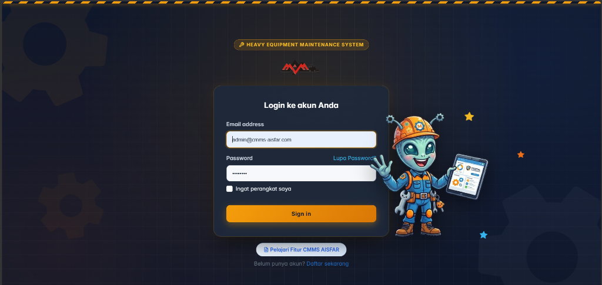
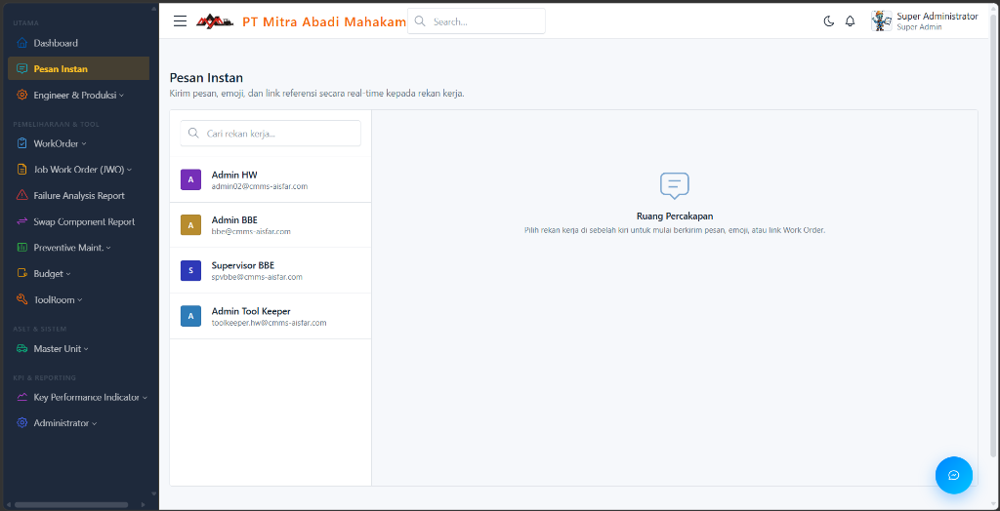
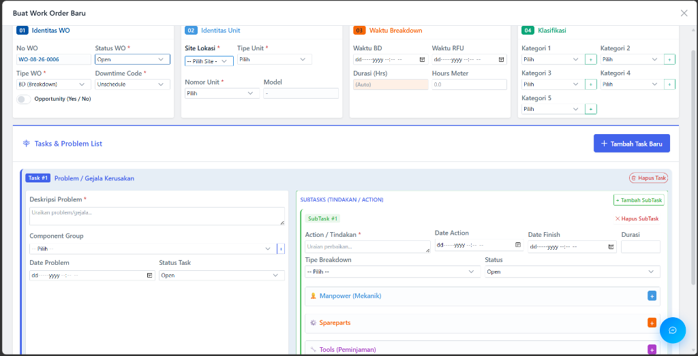
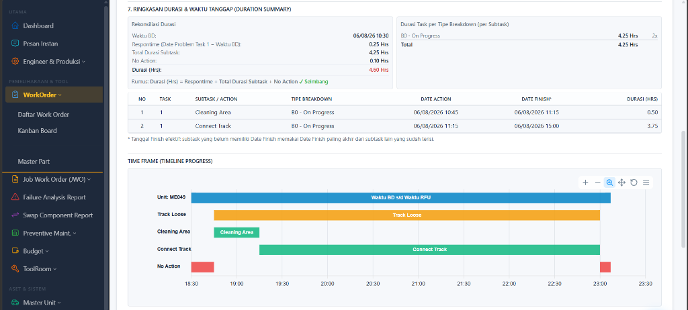
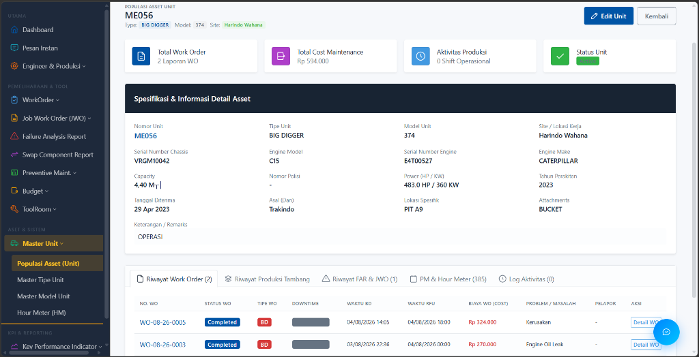

<div align="center">
  <br>
  <h1>CMMS AISFAR</h1>
  <p><b>Enterprise Computerized Maintenance Management System untuk Industri Pertambangan & Alat Berat</b></p>
  
  [](https://php.net/)
  [](https://laravel.com/)
  [](#)
</div>

<br>

## 📖 Tentang Aplikasi
**CMMS AISFAR** adalah Sistem Manajemen Pemeliharaan Aset dan Logistik Gudang komprehensif yang dirancang khusus untuk ekosistem industri pertambangan. Platform ini bertindak sebagai *Single Source of Truth* untuk mengelola siklus hidup alat berat (Excavator, Dozer, Hauler), dari penjadwalan *Preventive Maintenance*, manajemen Work Order, pelacakan suku cadang, hingga analitik KPI keandalan unit.

Aplikasi ini mendigitalisasi seluruh proses operasional workshop yang sebelumnya berbasis kertas menjadi **100% Paperless** melalui fitur *Digital Signature* dan *Real-time Collaboration*.

---

## ✨ Modul Utama (Ecosystem)

1. **🛠️ Work Order Management**
   - Pencatatan Breakdown, Backlog, dan Service unit. Terintegrasi dengan pemotongan stok Part, dokumen HSE, dan Approval Tanda Tangan Digital 3 Tingkat.
2. **📦 ToolRoom & Stok Part Inventory**
   - Manajemen sirkulasi Special Service Tools (SST), Sertifikasi Kalibrasi ISO/IEC 17025 (Auto-Lockout), Hierarki *Bin Location* Gudang, dan Tata Kelola Kanibalisasi (*Part Swapping*).
3. **🚜 Asset Intelligence (360° Unit History)**
   - Rekam jejak lengkap *Life Cycle Cost* setiap unit alat berat, riwayat perbaikan, konsumsi part, dan histori pergerakan komponen.
4. **📊 Analytics KPI & ISO 8601**
   - Perhitungan MTTR (Mean Time To Repair), MTBF (Mean Time Between Failures), dan *Physical Availability* (PA) menggunakan standar kalender minggu ISO 8601.
5. **🛡️ Safety & HSE (K3)**
   - Integrasi langsung 3 pilar K3 di dalam Work Order: JSA (*Job Safety Analysis*), PTW (*Permit to Work*), dan LOTO (*Lockout/Tagout*).
6. **📉 Failure Analysis Report (FAR)**
   - Investigasi *Root Cause Analysis* (RCA) 4 pilar untuk kerusakan komponen mayor (Major Component Failure).
7. **⏱️ Preventive Maintenance (PM)**
   - Templat jadwal servis berkala otomatis (PS1-PS4) berdasarkan Hour Meter (HM) unit dengan *Due Date Warning* dan *1-Click Auto-Generate WO*.
8. **💬 Live Chat & Collaboration**
   - Fitur *Floating Chat Widget* untuk komunikasi mekanik, planner, dan supervisor secara *real-time* menggunakan Laravel Echo & WebSockets.
9. **📈 Laporan Produksi Harian**
   - Pencatatan ritasi *Digger* dan *Hauler* per jam, lengkap dengan material tambang (Coal, OB, Top Soil) dan delay operasional.
10. **💼 Budget & Vendor (JWO)**
    - Kontrol anggaran (Plan vs Actual Cost) dan pengelolaan *Job Work Order* untuk perbaikan pihak ketiga (Vendor/Outsource).

---

## 💻 Tech Stack & Arsitektur Enterprise

Aplikasi dibangun dengan fondasi yang tangguh untuk menjamin keamanan dan performa kelas *Enterprise*:

- **Backend:** Laravel 10 (PHP 8.1+)
- **Frontend / UI:** Blade Templating, Vanilla CSS/JS, Tabler UI Framework
- **Database:** MySQL / PostgreSQL
- **Security:**
  - **Hashids (Anti-IDOR):** ID database dienkripsi di URL (contoh: ID `1` menjadi `jR3xY`) untuk mencegah *Insecure Direct Object Reference*.
  - Perlindungan bawaan Laravel terhadap serangan XSS, CSRF, dan SQL Injection.
- **Access Control:** Spatie RBAC (Role-Based Access Control) untuk pemisahan *Privileges* per user role.
- **Audit Trail:** Spatie Activitylog untuk merekam seluruh riwayat aktivitas *Create/Update/Delete* data.
- **PDF Generation:** DomPDF untuk *export* dokumen resmi ber-Kop Surat.
- **Broadcasting:** Laravel Echo (Pusher / Soketi) untuk fitur Live Chat dan Notifikasi.

---

## 🚀 Panduan Instalasi (Development)

Ikuti langkah-langkah di bawah ini untuk menjalankan project secara lokal:

### Persyaratan Sistem
- PHP >= 8.1
- Composer
- Node.js & NPM
- MySQL / MariaDB Server

### Langkah Instalasi

1. **Clone Repository**
   ```bash
   git clone https://github.com/username/cmms-aisfar.git
   cd cmms-aisfar
   ```

2. **Install Dependensi PHP & Node.js**
   ```bash
   composer install
   npm install
   ```

3. **Konfigurasi Environment**
   Salin file `.env.example` menjadi `.env`:
   ```bash
   cp .env.example .env
   ```
   Buka file `.env` dan atur koneksi database Anda:
   ```env
   DB_CONNECTION=mysql
   DB_HOST=127.0.0.1
   DB_PORT=3306
   DB_DATABASE=cmms_aisfar
   DB_USERNAME=root
   DB_PASSWORD=
   ```

4. **Generate Application Key & Migration**
   Generate *app key*, jalankan migrasi database, dan *seeding* data awal (Role, Admin, Data Master):
   ```bash
   php artisan key:generate
   php artisan migrate:fresh --seed
   ```

5. **Build Asset & Jalankan Server Lokal**
   Kompilasi asset frontend dan jalankan server *development* Laravel:
   ```bash
   npm run dev
   # Buka terminal baru
   php artisan serve
   ```
   Aplikasi dapat diakses melalui `http://localhost:8000`.

---

## 👥 Pengguna / Roles

Sistem mendukung *Multi-Role* yang disesuaikan dengan hierarki struktural tambang:
- **Super Administrator:** Akses penuh ke *System Settings*, *Master Data*, dan log keamanan.
- **Maintenance Superintendent / Planner:** Perencana jadwal PM, budget, *Approval* final dokumen.
- **Supervisor / Foreman:** Verifikasi Work Order, penugasan pekerjaan, dan *Review* HSE di lapangan.
- **Mechanic / Operator:** Input HM, pengerjaan WO, dan permintaan barang.
- **Toolman / Warehouse:** Check-in/Check-out alat SST, *Issue Part*, *Stock Opname*.
- **Engineer / Production:** Pelaporan produksi harian (*Fleet* alat angkut dan gali).

---

## 📸 Antarmuka Aplikasi (Screenshots)

### 1. Halaman Login
Antarmuka gerbang masuk yang dirancang modern dengan ilustrasi maskot interaktif. Dilengkapi dengan pintasan menuju pusat panduan (*Guide*) bagi pengguna baru untuk memahami fitur ekosistem sebelum masuk ke dalam sistem.



### 2. Dashboard Eksekutif
Pusat kendali utama yang menyajikan ringkasan metrik operasional secara *real-time*. Menampilkan tren Work Order (WO) aktif, unit yang mengalami *breakdown*, grafik distribusi status, hingga pencapaian *Plant Achievement* untuk memudahkan pengambilan keputusan strategis.


### 3. Modul Pesan Instan (Live Chat)
Ruang kolaborasi terpadu yang terintegrasi di seluruh aplikasi. Memungkinkan mekanik, supervisor, dan *planner* untuk berkomunikasi langsung tanpa aplikasi pihak ketiga, berbagi tautan *Work Order*, serta mendiskusikan penanganan unit dengan cepat dan tepat.



### 4. Form Pembuatan Work Order
Formulir digital komprehensif untuk pencatatan kerusakan atau pemeliharaan unit. Dilengkapi dengan pemisahan *tab* pintar (Identitas WO, Identitas Unit, Waktu Breakdown, dan Klasifikasi) serta sistem penugasan *Subtask*, kebutuhan suku cadang, dan *manpower* secara rinci.



### 5. Detail & Laporan Work Order (Execution Sheet)
Halaman rincian eksekusi yang merangkum seluruh aktivitas pemeliharaan secara terstruktur. Tersedia fungsi ekspor *Report* (PDF A4), pembagian tautan instan, hingga formulir persetujuan Dokumen Keselamatan Kerja (HSE) seperti JSA, PTW, dan LOTO di satu tempat terpusat.


### 6. Rekonsiliasi Durasi & Timeline Progress
Visualisasi grafik garis waktu otomatis dari setiap *task* dan *subtask* pekerjaan yang dilakukan oleh mekanik. Memudahkan *supervisor* untuk melacak keseimbangan *Response Time*, total durasi perbaikan, serta menyoroti potensi hambatan (*No Action*) secara visual.



### 7. Bio Data & Riwayat Asset Unit
Pusat informasi (360° View) komprehensif untuk setiap aset alat berat. Menampilkan spesifikasi teknis, total akumulasi biaya *maintenance*, hingga riwayat historis seluruh siklus Work Order, dokumen FAR, dan catatan produksi tambang pada unit tersebut.



---

## 📚 Pusat Panduan (Guide)

Aplikasi memiliki modul Panduan Interaktif terintegrasi yang dapat diakses oleh publik maupun pengguna *login* pada endpoint `/guide`. Halaman panduan ini dilengkapi dengan animasi modern, penjelasan per-modul menggunakan infografis, dan *Pop-up Modal Quick View*.

---

<div align="center">
  <p>Dibuat dan dikembangkan untuk operasional <b>PT Mukti / CMMS AISFAR</b>.<br>Hak Cipta © 2026. Semua Hak Dilindungi.</p>
</div>
